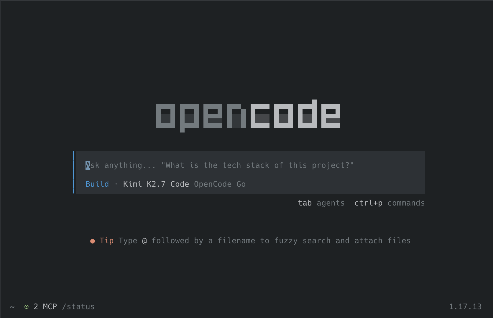

# Trash Panda Theme for OpenCode

A port of the [JetBrains Trash Panda Theme](https://github.com/jasonhulbert/jetbrains-trash-panda-theme) for the [OpenCode](https://opencode.ai) terminal AI coding agent.

A theme for raccoons and other creatures of the night.



## Variants

This repository includes all variants from the upstream JetBrains theme:

| File | Variant | Mode |
|------|---------|------|
| `.opencode/themes/trash-panda.json` | Default | Dark |
| `.opencode/themes/trash-panda-default-2026.json` | Default 2026 | Dark |
| `.opencode/themes/trash-panda-starlight.json` | Starlight | Dark |
| `.opencode/themes/trash-panda-moonlight.json` | Moonlight | Dark |
| `.opencode/themes/trash-panda-dawnlight.json` | Dawnlight | Dark |
| `.opencode/themes/trash-panda-blacklight.json` | Blacklight | Dark (high contrast) |
| `.opencode/themes/trash-panda-daylight.json` | Daylight | Light |

## Installation

### Option 1 — curl (fastest)

```bash
mkdir -p ~/.config/opencode/themes
curl -fsSL https://raw.githubusercontent.com/outsid3rx/opencode-trash-panda-theme/main/.opencode/themes/trash-panda.json \
  -o ~/.config/opencode/themes/trash-panda.json
```

Replace `trash-panda.json` with the variant you want.

### Option 2 — git clone + symlink

```bash
git clone https://github.com/outsid3rx/opencode-trash-panda-theme.git
mkdir -p ~/.config/opencode/themes
ln -s "$(pwd)/opencode-trash-panda-theme/.opencode/themes/trash-panda.json" \
  ~/.config/opencode/themes/trash-panda.json
```

### Option 3 — manual

Copy any file from `.opencode/themes/` into `~/.config/opencode/themes/`.

## Usage

Set the theme in your OpenCode configuration:

```bash
# ~/.config/opencode/opencode.json
{
  "$schema": "https://opencode.ai/config.json",
  "theme": "trash-panda"
}
```

Or switch temporarily inside OpenCode:

```
/theme
```

Then pick `trash-panda` (or the variant you installed) from the picker.

## Palette (Default variant)

| Role | Color | Hex |
|------|-------|-----|
| Background | Base 2 | `#1D2123` |
| Panel Background | Base 1 | `#141618` |
| Element Background | Base 3 | `#2C3135` |
| Text | Base 6 | `#b8babd` |
| Muted Text | Base 5 | `#727a7f` |
| Primary / Accent | Accent | `#406bf4` |
| Secondary | Blue | `#2c99db` |
| Error | Red | `#e8626f` |
| Warning | Orange | `#E8886D` |
| Success | Lime | `#8ec475` |
| Info | Cyan | `#50cae5` |

## Building

The theme files are generated from the upstream JetBrains YAML palette. To regenerate them:

```bash
python3 -m venv .venv
.venv/bin/pip install pyyaml jsonschema
.venv/bin/python scripts/build-opencode-themes.py
.venv/bin/python scripts/validate-themes.py
```

## Credits

- Original JetBrains theme: [jasonhulbert/jetbrains-trash-panda-theme](https://github.com/jasonhulbert/jetbrains-trash-panda-theme)
- OpenCode theme format: [opencode.ai](https://opencode.ai)

## License

MIT License — see [LICENSE](./LICENSE).
